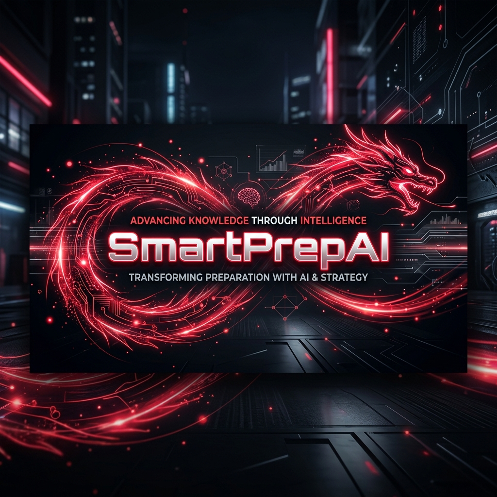
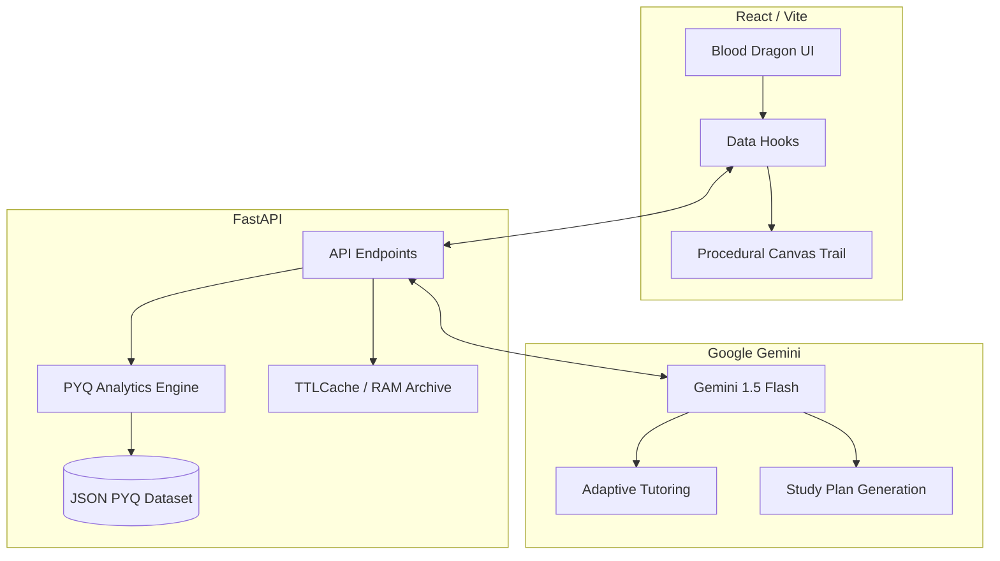

# <p align="center">🐉 SMARTPREPAI</p>

<p align="center">
  
</p>

<p align="center">
  <strong>The Ultimate Data-Driven Intelligence Pipeline for CBSE Class 9-12 Success.</strong>
</p>

<p align="center">
  
  
  
  
  
</p>

---

## 🌟 The Vision

SmartPrepAI was engineered to solve **Academic Information Overload.** In a world where students are buried in resources, SmartPrepAI acts as a high-fidelity filter. It identifies the "signal within the noise" by analyzing thousands of Previous Year Questions (PYQs) to provide hyper-specific focus areas, adaptive study strategies, and AI-powered tutoring.

---

### 🧬 Hierarchical Curriculum Intelligence
*   **Structured Analysis**: Filters intelligence by Class (9-12), Subject, Chapter, and Topic.
*   **Statistical Precision**: Pure Python analysis of PYQ frequency, chapter importance, and difficulty distributions.

### 🤖 Adaptive AI Tutor & Strategist
*   **Conversational Logic**: An AI tutor that adapts its tone based on your performance—encouraging for those struggling, academic for those excelling.
*   **Predictive Strategies**: Instant generation of daily study plans based on real exam data and your specific timeline.

### 🎨 The "Blood Dragon" Experience
*   **Premium UI**: A high-contrast Red & Black theme designed for maximum focus.
*   **Interactive Physics**: Custom canvas-based procedural animation for a unique interactive cursor trail.
*   **Zero-Lag Performance**: Optimized memory-cached backend and a lightweight Vite frontend.

---

## 🏗️ Technical Architecture



---

## 🛠️ Technology Stack

| Layer | Technologies |
| :--- | :--- |
| **Frontend** | React, Vite, Framer Motion, Tailwind CSS, Canvas API |
| **Backend** | Python 3.10+, FastAPI, Uvicorn, Cachetools |
| **AI/ML** | Google Gemini 1.5 Flash (Generative AI) |
| **Automation** | Batch Scripting (PowerShell compatible) |

---

## 🚀 Quick Start (Windows)

Launch the entire ecosystem with a single command. The system will handle environment checks, dependency installation, and server orchestration.

```powershell
# In the project root
.\start.bat
```

### Manual Setup
1. **Backend**:
   - `pip install -r backend/requirements.txt`
   - Add `GEMINI_API_KEY` to `backend/.env`
   - `python backend/main.py`
2. **Frontend**:
   - `cd frontend && npm install`
   - `npm run dev`

---

## 🤖 Built with Intelligence

SmartPrepAI is the result of a deep collaboration between human design and **Antigravity**, an advanced agentic AI coding assistant. From the "Blood Dragon" canvas interaction to the optimized memory dataset archiving, the system was built using cutting-edge AI-human pair programming.

---

<p align="center">
  <i>"Success is the sum of small efforts, repeated day in and day out."</i><br>
  <b>Built for the architects of the future. 🐉</b>
</p>
